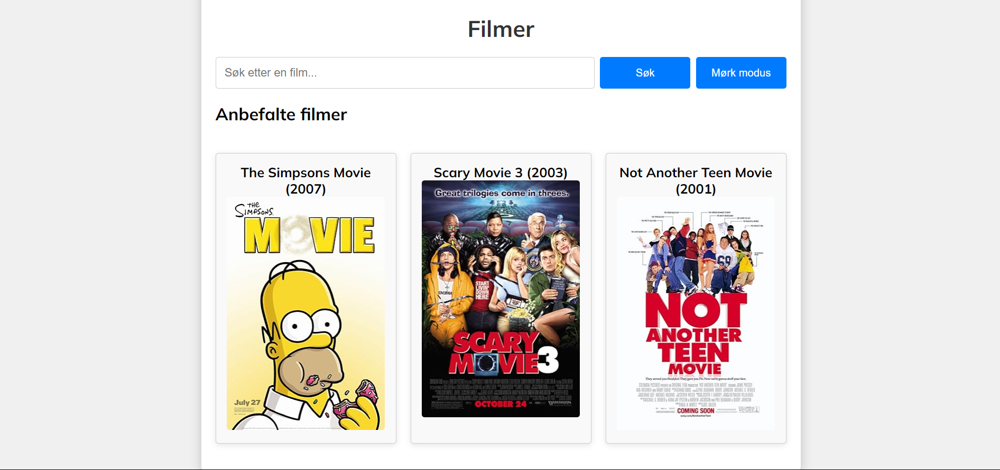
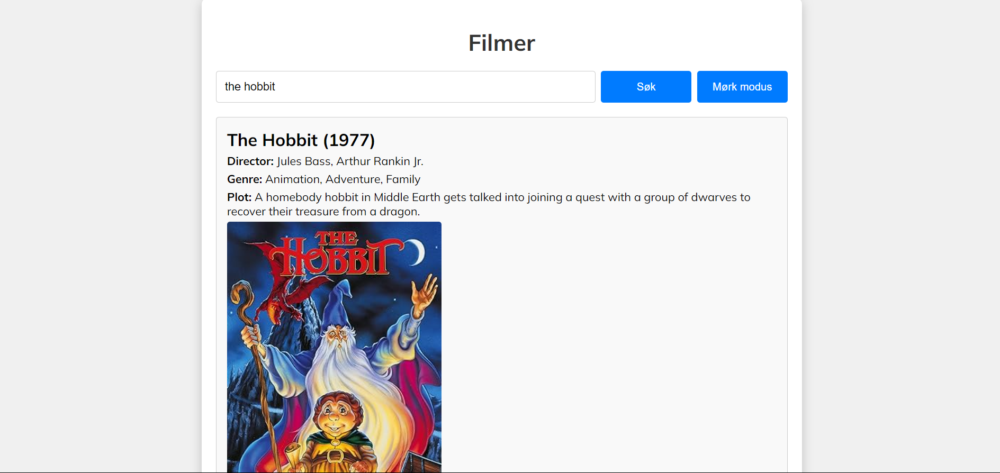

<h1 align="center">OMDb Filmer</h1>
<div align="center">
  <h3>
    <a href="https://github.com/SanteriWille/JS15-API_6">
      Lenken til prosjektet
    </a>
  </h3>
</div>
<!-- TABLE OF CONTENTS -->

## Table of Contents

- [Overview](#overview)
- [Built With](#built-with)
- [Features](#features)
- [How to use](#how-to-use)
- [Contact](#contact)

<!-- OVERVIEW -->
## Overview
Denne nettsiden lar brukere søke etter filmer ved hjelp av OMDb API. Brukeren kan skrive inn et søkeord, og filmen som matcher søket vil vises sammen med relevante detaljer (tittel, årstall, regissør, sjanger, og plakat). Anbefalte filmer vil vises basert på søkeresultatet, og hver gang siden lastes inn, vises 3 tilfeldige anbefalinger automatisk.

### Built With
- [HTML](https://www.w3schools.com/html/)
- [CSS](https://www.w3schools.com/css/default.asp)
- [Javscript](https://www.w3schools.com/js/)
- [API](https://www.omdbapi.com/)

## Features
- Filmsøk ved hjelp av OMDb API
- Viser detaljer om filmen inkludert tittel, år, regissør, sjanger og plakat
- Anbefalinger av 3 filmer relatert til søket
- 3 tilfeldige anbefalte filmer ved sidens første lastning

## How To Use
Hvilke koder har du brukt? Skrive her:

```
HTML 
- Søkeinput-felt
- Område for å vise filmresultater
- Område for å vise anbefalte filmer

CSS 
- Layout for filmresultater og anbefalinger
- Styling av søkefeltet og resultatboksene

Javascript
- Bruker OMDb API til å hente data om filmer basert på søkeordet
- Viser filmplakat og informasjon (tittel, år, regissør, sjanger, plot)
- Henter og viser 3 anbefalte filmer basert på søket
- Henter 3 tilfeldige filmer når siden lastes inn

```

## Contact
- GitHub [Santeri Wille](https://github.com/SanteriWille)
- Epost [Santeri Wille](mailto:santeriwille@gmail.com)

## Happy coding!

## Forventet resultat


